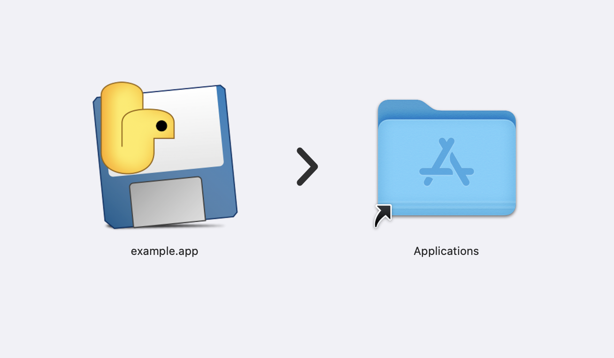

# Create from python code a macOS app

Create your own app for Apple macOS and more.

# Needed

We need NodeJS and Python.

## Install first

- https://nodejs.org/
- https://www.python.org/

### Check it out

- For `npm` get a look here: [Best practice](https://gist.github.com/prod3v3loper/979fd70264319e86ffff037996d3d7e7)
- For `python` get a look here: [Best practice](https://gist.github.com/prod3v3loper/3be347af91e3eb4fb7fa23f899719c3c)

## Then extensions

For NPM:

```bash
$ npm install -g create-dmg
```

For python:

```bash
$ pip3 install pyinstaller
```

OR

```bash
$ pip3 install -r requirements.txt
```

You can list your packages here:

`requirements.txt`

```plaintext
pyinstaller 
```

## One file app



Create `example.py`

```python
import tkinter as tk

def say_hello():
    print("Hello, World!")

app = tk.Tk()
app.title("Simple App")

hello_button = tk.Button(app, text="Say Hello", command=say_hello)
hello_button.pack(pady=20)

app.mainloop()
```

And then packaging with PyInstaller:

```bash
$ pyinstaller --onefile --windowed example.py
```

And now create from dist folder your app:

```bash
$ create-dmg dist/example.app
```

You see this message after creating without a code signing: 

```bash
✖ No suitable code signing identity found
```

Run create-dmg with the --no-skip-checks option to skip code signing:

```bash
create-dmg dist/example.app --no-skip-checks
```

## Free options for code signing

However, there are also some free options if you just want to test apps on your own device or do not plan on official distribution via the App Store.

You can create a free Apple Developer account to test apps on your own devices. This has some limitations, such as the need to renew the certificate every seven days, but it is sufficient for basic testing.

- Download Xcode from the Mac App Store.
- Open Xcode and go to Xcode > Preferences > Accounts.
- Go to the project's "Signing & Capabilities".
- Select your Apple ID profile from the team drop-down menu.
- Xcode automatically creates a signed certificate for you if you use the free developer account.

```bash
codesign --deep --force --verify --verbose --sign "Developer ID Application: Your Name (Team ID)" dist/example.app
```

After codesign

```bash
$ create-dmg dist/example.app
```

## Sign and distribute apps with a paid developer account

If you want code signing, create a [Apple Developer Account](https://developer.apple.com/) and join **Apple Developer Program** currently costs $99 per year.

### Create certificates and provisioning profiles:

Once you're a member, you can create certificates and provisioning profiles needed to sign and publish your apps.

- Sign in to the Apple Developer Account.
- Go to the Certificates, IDs & Profiles section.
- Create a Developer ID Application certificate for signing apps outside of the Mac App Store.

Sign the app:

After you've created and downloaded the certificate, open the Keychain Access app on your Mac and import the certificate.

```bash
$ codesign --deep --force --verify --verbose --sign "Developer ID Application: Your Name (Team ID)" dist/example.app
```

After codesign

```bash
$ create-dmg dist/example.app
```

Notes:

- **Using your private Apple ID**: When you use your private Apple ID, all apps and certificates are connected to your personal information. 

> If you don't want this, you can create a separate Apple ID just for development.

- **Team ID**: The Team ID is a unique identifier assigned to you when you join the Apple Developer Program. You can find this in your Apple Developer Account.

## Full Project

Do you have more than one file or multiple files for your program?

```
python-mac-app/
├── main.py
├── module1.py
├── module2.py
├── python-mac-app.spec
├── assets/
│   ├── image.png
│   └── data.json
└── ...
```

Create the `python-mac-app.spec`

```
# -*- mode: python ; coding: utf-8 -*-

block_cipher = None

a = Analysis(
    ['main.py'],
    pathex=['./python-mac-app'],
    binaries=[],
    datas=[
        ('assets/image.png', 'assets'),
        ('assets/data.json', 'assets')
    ],
    hiddenimports=[],
    hookspath=[],
    runtime_hooks=[],
    excludes=[],
    win_no_prefer_redirects=False,
    win_private_assemblies=False,
    cipher=block_cipher,
    noarchive=False
)

pyz = PYZ(a.pure, a.zipped_data, cipher=block_cipher)

exe = EXE(
    pyz,
    a.scripts,
    [],
    exclude_binaries=True,
    name='main',
    debug=False,
    bootloader_ignore_signals=False,
    strip=False,
    upx=True,
    console=False
)

coll = COLLECT(
    exe,
    a.binaries,
    a.zipfiles,
    a.datas,
    strip=False,
    upx=True,
    upx_exclude=[],
    name='main'
)
```

And now use the spec file to create your app:

```bash
$ pyinstaller python-mac-app.spec
```

And then create from dist folder your app:

```bash
$ create-dmg dist/python-mac-app.app
```

# ISSUE

Please use the issue tab to request a:

* Bug
* Feature

Choose template and report a bug or feature you want [issues](https://github.com/prod3v3loper/python-mac-app/issues).

# CONTRIBUTE

Please read the [contributing](https://github.com/prod3v3loper/python-mac-app/blob/main/.github/CONTRIBUTING.md) to contribute.

# VULNERABILITY

Please use the Security section for privately reporting a [vulnerability](https://github.com/prod3v3loper/python-mac-app/SECURITY.md).

# AUTHOR

[prod3v3loper](https://www.prod3v3loper.com)

# License

[MIT](https://github.com/prod3v3loper/python-mac-app/blob/main/LICENSE)